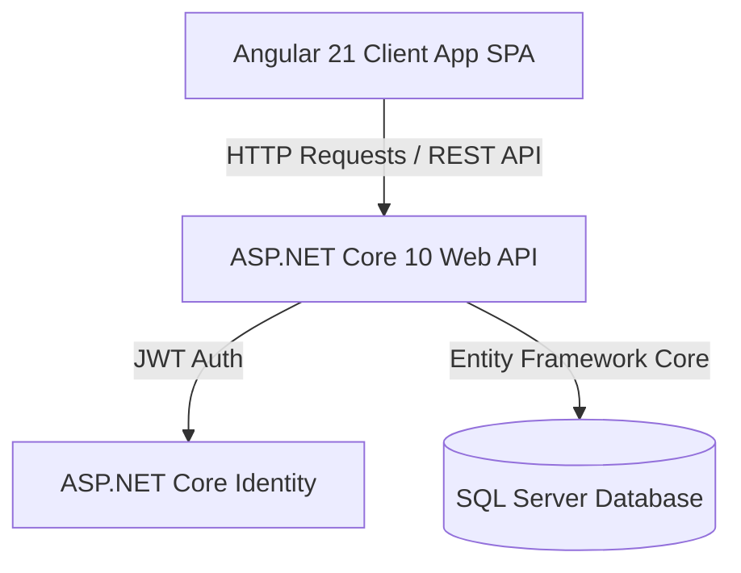
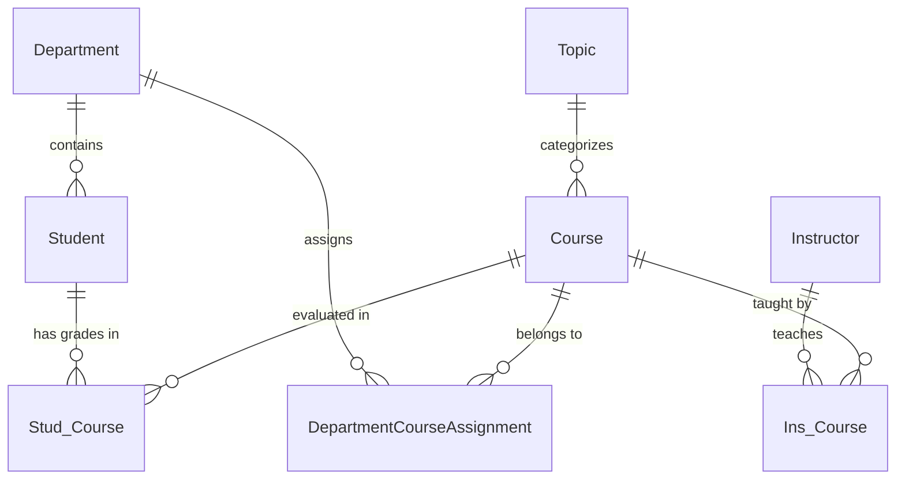

# دليل وجمارك الشرح الشامل لنظام إدارة الطلاب (Student Management System)

هذا المستند يقدم شرحاً تفصيلياً معمارياً ووظيفياً لنظام **إدارة الطلاب (Student Management System)**، وهو منصة متكاملة (Full-Stack) مخصصة لإدارة المؤسسات الأكاديمية والتعليمية.

---

## 📌 1. نظرة عامة على النظام (System Overview)

نظام **Student Management System** هو منصة ويب متكاملة تتيح لإدارات الكليات والأكاديميات تنظيم كافة العمليات الأكاديمية اليومية، والتي تشمل:
- إدارة بيانات الطلاب وتوزيعهم على الأقسام.
- إدارة الأقسام الأكاديمية وتوزيع المقررات (الكورسات) عليها.
- إدارة المقررات الدراسية وتفاصيلها.
- رصد وتحديث درجات الطلاب في المواد المختلفة.
- نظام حماية وأمان مبني على أدوار المستخدمين والمصادقة المعتمدة على JWT Tokens.

---

## 🏗️ 2. الهيكلية المعمارية (System Architecture)

يعتمد النظام على نمط **Decoupled Architecture (فصل واجهة المستخدم عن الخدمات الخلفية)**، مما يوفر مرونة عالية، سهولة في الصيانة، وإمكانية التوسع مستقبلاً.



### 🔹 الجزء الخلفي (Backend Stack):
- **الإطار البرمجي:** ASP.NET Core Web API (.NET 10).
- **الوصول للبيانات (ORM):** Entity Framework Core مع SQL Server.
- **إدارة الهوية والأمان:** ASP.NET Core Identity + JWT (JSON Web Tokens).
- **التحويل بين الكائنات:** AutoMapper للتحويل بين الـ Entities والـ DTOs.
- **التوثيق:** Swagger / OpenAPI لمكشوفية الـ API وتجربته.
- **نمط التصميم (Design Patterns):** Repository Pattern لتجريد التعامل مع البيانات، و DTO Pattern لحماية البيانات المستهدفة في الطلبات والاستجابات.

### 🔹 الجزء الأمامي (Frontend Stack):
- **الإطار البرمجي:** Angular 21 (Stand-alone Components).
- **إدارة الحالة والعمليات اللا تزامنية:** RxJS (Observables & Subjects).
- **التصميم والواجهات:** Bootstrap 5 + Bootstrap Icons لضمان التجاوب (Responsive UI).
- **الحماية بالتوجيه:** Angular Route Guards (`authGuard`).
- **المعالجة التلقائية للطلبات:** HTTP Interceptors لإرفاق توكن JWT تلقائياً مع كل طلب.

---

## 💾 3. تصميم قاعدة البيانات والنماذج (Database Models & Schema)

تحتوي قاعدة البيانات على العلاقات الأكاديمية التالية:



### 📋 تفاصيل الجداول والـ Entities:

1. **`Student` (الطلاب):**
   - البيانات: `Id`, `Fname`, `Lname`, `Address`, `Age`, `Dep_Id`.
   - العلاقات: ينتمي إلى قسم واحد (`Department`) ولديه سجل درجات في مواد متعددة (`Stud_Course`).

2. **`Department` (الأقسام الأكاديمية):**
   - البيانات: `Id`, `Name`, `Location`, `ManagerId`, `HiringDate`.
   - العلاقات: يحتوي على عدة طلاب، وعدة كورسات مرتبطة به عبر جدول الربط `DepartmentCourseAssignment`.

3. **`Course` (المقررات الدراسية):**
   - البيانات: `Id`, `Name`, `Duration`, `Top_Id`.
   - العلاقات: يرتبط بموضوع (`Topic`)، وبأقسام متعددة، وبالطلاب من خلال درجاتهم.

4. **`Stud_Course` (جدول الربط والدرجات بين الطلاب والمواد):**
   - البيانات: `Stud_ID`, `Course_ID`, `Grade`.
   - الغرض: مفتاح مركب لتخزين درجة طالب معين في مادة معينة.

5. **`DepartmentCourseAssignment` (ربط المواد بالأقسام):**
   - البيانات: `Dept_ID`, `Course_ID`.
   - الغرض: تحديد المواد التابعة لكل قسم أكاديمي.

6. **`ApplicationUser` (حساب المستخدم للنافذة الأكاديمية):**
   - يمتد من `IdentityUser` لتخزين معلومات الدخول (اسم المستخدم، كلمة المرور المفرومة، الأدوار).

---

## 🔌 4. خدمات ونقاط الاتصال للـ API (Backend Endpoints)

### 🔐 1. AuthController (`/api/Auth`)
- `POST /api/Auth/register`: إنشاء حساب جديد للمستخدم.
- `POST /api/Auth/login`: التحقق من الحساب وتوليد توكن JWT.

### 🎓 2. StudentsController (`/api/Students`)
- `GET /api/Students`: جلب قائمة جميع الطلاب مع تفاصيل الأقسام والدرجات.
- `GET /api/Students/{id}`: جلب تفاصيل طالب معين.
- `POST /api/Students`: إضافة طالب جديد.
- `PUT /api/Students/{id}`: تحديث بيانات طالب.
- `DELETE /api/Students/{id}`: حذف طالب من النظام.

### 🏢 3. DepartmentController (`/api/Department`)
- `GET /api/Department`: عرض كل الأقسام الأكاديمية.
- `GET /api/Department/{id}`: تفاصيل قسم محدد مع الطلاب والمواد التابعة له.
- `POST /api/Department`: إنشاء قسم أكاديمي جديد.
- `PUT /api/Department/{id}`: تعديل بيانات القسم.
- `DELETE /api/Department/{id}`: حذف قسم.

### 📚 4. CoursesController (`/api/Courses`)
- `GET /api/Courses`: جلب كل الكورسات والمقررات.
- `POST /api/Courses`: إضافة كورس جديد.
- `POST /api/Courses/assign-department`: ربط كورس بقسم أكاديمي.
- `DELETE /api/Courses/unassign-department`: إلغاء ربط كورس بقسم.
- `PUT /api/Courses/update-grade`: رصد وتحديث درجة طالب في مادة معينة.

---

## 🖥️ 5. هيكلية واجهة المستخدم (Angular Frontend Architecture)

تم تقسيم واجهة المستخدم في مجلد `src/app` بصورة منظمّة وموزعة كالتالي:

```
src/app/
├── Components/
│   ├── login/           # صفحة تسجيل الدخول
│   ├── register/        # صفحة تسجيل حساب جديد
│   ├── student/         # عرض وإدارة بيانات الطلاب والدرجات
│   ├── department/      # عرض وإدارة الأقسام وتعيين المواد
│   ├── course/          # إدارة الكورسات
│   ├── header/          # شريط الملاحة الأعلى (Navbar)
│   ├── footer/          # التذييل (Footer)
│   └── home/            # الصفحة الرئيسية (Dashboard)
├── Services/            # التفاعل مع الـ APIs عبر HTTP Requests
│   ├── auth.service.ts
│   ├── student.service.ts
│   ├── department.service.ts
│   └── course.service.ts
├── guards/              # حماية المسارات (AuthGuard)
└── interceptors/        # حقن JWT Token مع الـ Headers تلقائياً
```

---

## 🔄 6. تدفق العمليات الرئيسي (Business Workflow)

1. **دخول النظام والمصادقة:**
   - يفتح المستخدم التطبيق وينتقل لصفحة `Login`.
   - عند إدخال البيانات الصالحة، يرجع الـ API بتوكن **JWT**.
   - يتم حفظ التوكن في الـ LocalStorage/Session وتفعيله مع كل طلب عبر الـ `AuthInterceptor`.

2. **إدارة الهيكل الأكاديمي:**
   - يتم إضافة الأقسام أولاً (مثلاً: قسم الحاسبات، قسم التكنولوجيا).
   - يتم إضافة المواد الدراسية، ثم ربطها بالأقسام المناسبة (`assign-department`).

3. **إدارة الطلاب والدرجات:**
   - يتم إضافة الطلاب وتعيينهم للأقسام الخاصة بهم.
   - يفتح المسئول شاشة درجات الطلاب لارصد وتسجيل الدرجات (`update-grade`) وتحديث البيانات فورياً.

---

## 🚀 7. كيفية تشغيل المشروع (How to Run)

### 1️⃣ تشغيل الـ Backend API:
```powershell
cd "BackEnd/API01"
dotnet restore
dotnet ef database update   # لتطبيق الترحيلات وإنشاء داتابيز SQL Server
dotnet run --launch-profile http
```
- المسار المفعل: `http://localhost:5218/api`
- رابط وثائق السواجر: `http://localhost:5218/swagger`

### 2️⃣ تشغيل تطبيق Angular:
```powershell
cd "FrontEnd"
npm install
npm start
```
- المسار المفعل: `http://localhost:4200`

### 🔑 بيانات الدخول الافتراضية (Seeded Admin):
- **اسم المستخدم:** `admin`
- **كلمة المرور:** `Admin123!`

---
